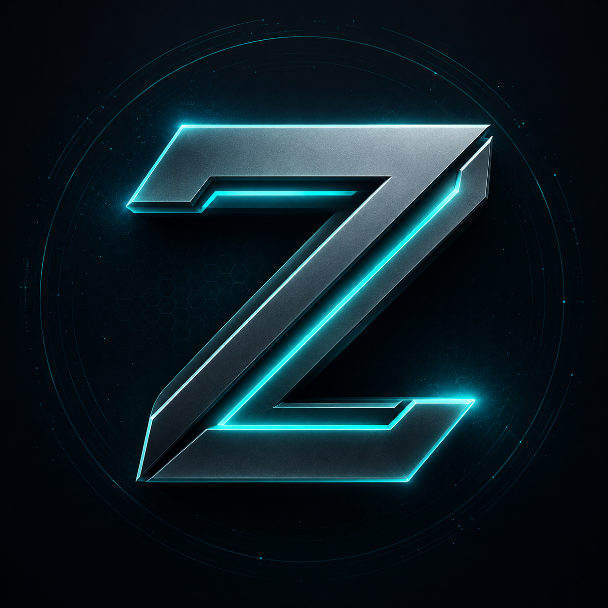

<table width="100%">
<tr>
<td><strong>README.md</strong></td>
<td align="right"><a href="https://github.com/zagoourai-hub">Profile</a> &nbsp; <a href="https://github.com/zagoourai-hub?tab=repositories">Repositories</a></td>
</tr>
</table>

<table width="100%">
<tr>
<td width="66%" valign="middle">

### Hi, I'm 👋

# Riss **Zagoour**

### Full-Stack Developer & AI Enthusiast

Saya membangun aplikasi web modern yang cepat, aman, dan berfokus pada pengalaman pengguna.

`Jawa Barat, Indonesia` &nbsp; [hello@zagoour.dev](mailto:hello@zagoour.dev) &nbsp; [GitHub](https://github.com/zagoourai-hub)

</td>
<td width="34%" align="center" valign="middle">

 

`● Open to Work`

</td>
</tr>
</table>

---

## About Me

<table width="100%">
<tr>
<td width="25%" valign="top">

**Focus**

Membangun produk digital yang bermanfaat dan berdampak.

</td>
<td width="25%" valign="top">

**Stack**

Menyukai TypeScript, Python, dan teknologi modern.

</td>
<td width="25%" valign="top">

**Mindset**

Terus belajar, membangun, dan berbagi.

</td>
<td width="25%" valign="top">

**Goal**

Membangun solusi dengan AI untuk menyelesaikan masalah nyata.

</td>
</tr>
</table>

## Tech Stack

<table width="100%">
<tr>
<td width="25%" valign="top">

**Frontend**

 Next.js 
 React 
 TypeScript 
 Tailwind CSS 
 Shadcn UI

</td>
<td width="25%" valign="top">

**Backend**

 Python 
 FastAPI 
 PostgreSQL 
 SQLAlchemy 
 Redis

</td>
<td width="25%" valign="top">

**Tools & DevOps**

 Git & GitHub 
 Docker 
 Nginx 
 Linux 
<code>VPS</code>

</td>
<td width="25%" valign="top">

**Others**

 OpenAI API 
 LangChain 
 Pydantic 
 Celery 
 VS Code

</td>
</tr>
</table>

## Featured Projects

<table width="100%">
<tr>
<td width="33%" valign="top">

### Rissz Portfolio

Portfolio full-stack dan CMS untuk project, layanan, harga, serta rating pelanggan terverifikasi.

`Next.js` `TypeScript` `Prisma`

[View repository](https://github.com/zagoourai-hub/Portfolio-Personal)

</td>
<td width="33%" valign="top">

### Cyber-Neobrutalism

Portfolio interaktif dengan CMS terautentikasi, pengelolaan konten, dan deployment Docker.

`Next.js` `PostgreSQL` `Docker`

[View repository](https://github.com/zagoourai-hub/porto-neobrutalsm)

</td>
<td width="33%" valign="top">

### Zagoour Skills Pack

Skill pack berbasis profil untuk Claude Code, Codex CLI, dan Antigravity.

`PowerShell` `Shell` `Agent workflows`

[View repository](https://github.com/zagoourai-hub/Skills)

</td>
</tr>
</table>

## GitHub Activity

<table width="100%">
<tr>
<td width="68%" align="center" valign="middle">

</td>
<td width="32%" valign="middle">

> Code is like humor. When you have to explain it, it's bad.

Cory House

</td>
</tr>
</table>

---

© 2026 Riss Zagoour

