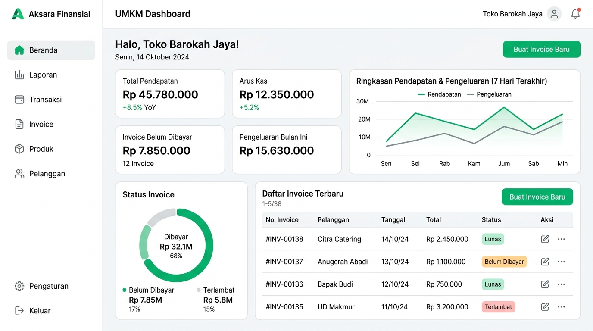
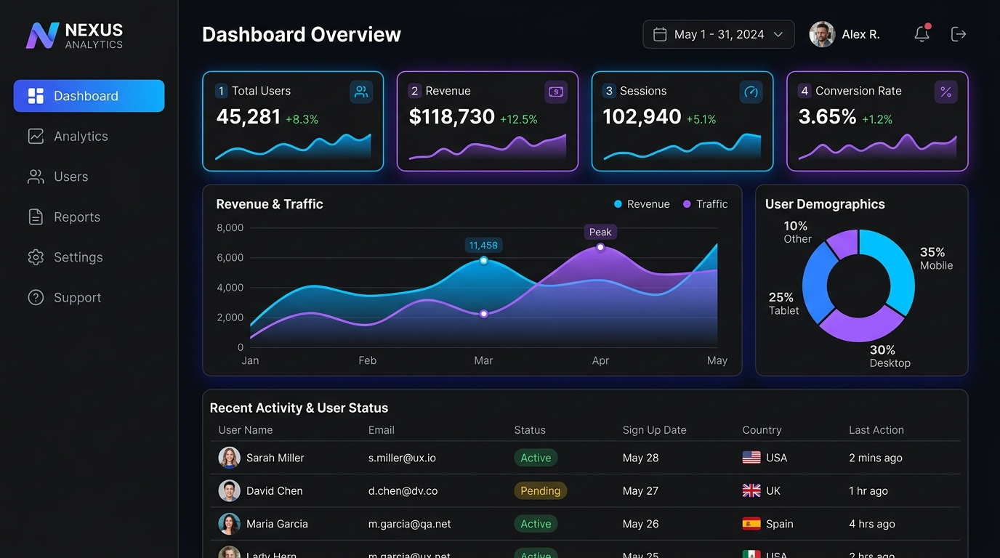
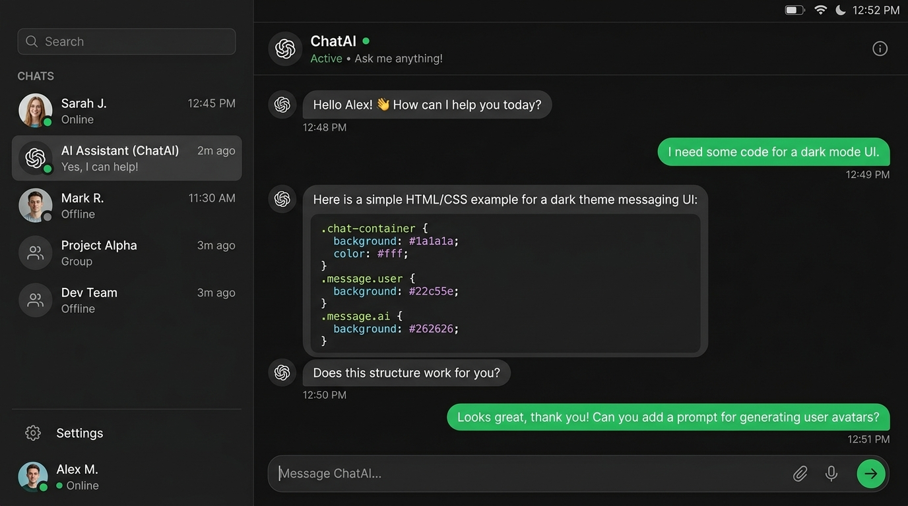

<table>
<tr>
<td>

## Riss **Zagoour**

**Full-Stack Developer & AI Enthusiast**

Saya membangun aplikasi web modern yang cepat, aman,
dan berfokus pada pengalaman pengguna.

📍 Jawa Barat, Indonesia &nbsp;&nbsp; ✉️ hello@zagoour.dev &nbsp;&nbsp; 🔗 zagoour.dev

<a href="https://github.com/zagoourai-hub"></a>
<a href="https://linkedin.com/in/zagoour"></a>
<a href="https://instagram.com/zagoour"></a>
<a href="mailto:hello@zagoour.dev"></a>

</td>
<td align="center" width="280">


<br/>

`🟢 Open to Work`

</td>
</tr>
</table>

---

### 👤 About Me

<table>
<tr>
<td align="center" width="25%">
<br/>
<b>🎯 Focus</b>
<br/><br/>
Membangun produk digital yang bermanfaat dan berdampak.
<br/><br/>
</td>
<td align="center" width="25%">
<br/>
<b>&lt;/&gt; Stack</b>
<br/><br/>
Menyukai TypeScript, Python, dan teknologi modern.
<br/><br/>
</td>
<td align="center" width="25%">
<br/>
<b>🧠 Mindset</b>
<br/><br/>
Terus belajar, membangun, dan berbagi.
<br/><br/>
</td>
<td align="center" width="25%">
<br/>
<b>⚡ Goal</b>
<br/><br/>
Membangun solusi dengan AI untuk menyelesaikan masalah nyata.
<br/><br/>
</td>
</tr>
</table>

---

### 🖥 Tech Stack

<table>
<tr>
<td width="25%" valign="top">

**Frontend**

 &nbsp; Next.js <br/>
 &nbsp; React <br/>
 &nbsp; TypeScript <br/>
 &nbsp; Tailwind CSS <br/>
 &nbsp; Shadcn UI

</td>
<td width="25%" valign="top">

**Backend**

 &nbsp; Python <br/>
 &nbsp; FastAPI <br/>
 &nbsp; PostgreSQL <br/>
 &nbsp; SQLAlchemy <br/>
 &nbsp; Redis

</td>
<td width="25%" valign="top">

**Tools & DevOps**

 &nbsp; Git & GitHub <br/>
 &nbsp; Docker <br/>
 &nbsp; Nginx <br/>
 &nbsp; Linux (Ubuntu) <br/>
 &nbsp; VPS

</td>
<td width="25%" valign="top">

**Others**

 &nbsp; OpenAI API <br/>
 &nbsp; LangChain <br/>
 &nbsp; Pydantic <br/>
 &nbsp; Celery <br/>
 &nbsp; VS Code

</td>
</tr>
</table>

---

### 📁 Featured Projects

<table>
<tr>
<td align="center" width="33%">


<br/>

**AI Asisten Hitung HPP**

Aplikasi asisten AI untuk menghitung Harga Pokok Produksi (HPP) UMKM.

  

🔗 [AI-ASISTEN-Hitung-HPP](https://github.com/zagoourai-hub/AI-ASISTEN-Hitung-HPP)

</td>
<td align="center" width="33%">


<br/>

**Portfolio Personal**

Website portfolio personal modern dengan desain interaktif.

  

🔗 [Portfolio-Personal](https://github.com/zagoourai-hub/Portfolio-Personal)

</td>
<td align="center" width="33%">


<br/>

**Porto Neobrutalism**

Website portfolio dengan desain neobrutalism yang unik dan bold.

  

🔗 [porto-neobrutalsm](https://github.com/zagoourai-hub/porto-neobrutalsm)

</td>
</tr>
</table>

---

### 📊 GitHub Stats

<table>
<tr>
<td width="33%">

```text
Total Repositories   24
Total Stars         120
Total Commits     1.2k+
Contribution Streak  🔥 45 days
```

</td>
<td align="center" width="34%">

<a href="https://github.com/zagoourai-hub"></a>

</td>
<td width="33%">

> **❝**
>
> *Code is like humor. When you have to explain it, it's bad.*
>
> — **Cory House**

</td>
</tr>
</table>

---

<p align="center">
  <sub>© 2025 Riss Zagoour • Built with ❤️ and lots of ☕</sub>
</p>
